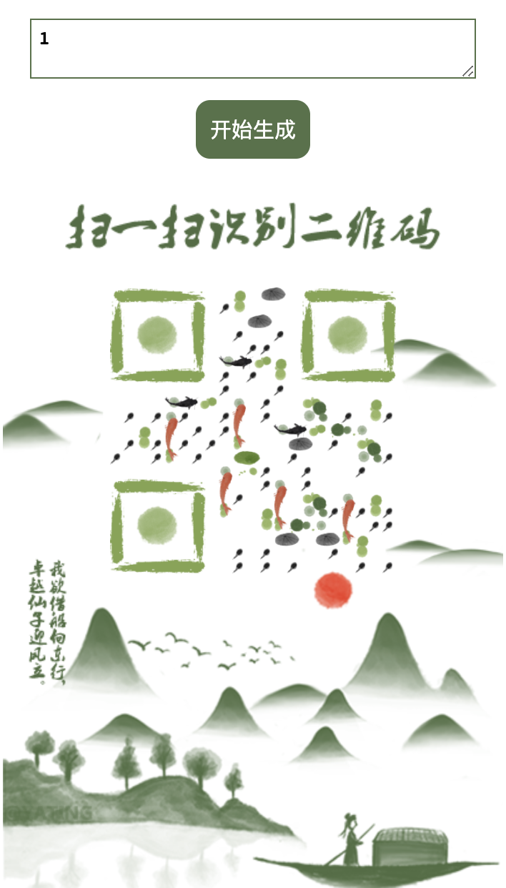

# art-qrcode

## 下载方式
```
npm i art-qrcode
```

[预览地址](http://yating.online/demo/qr/): http://yating.online/ART-QRCode/

[艺术二维码生成原理](https://blog.csdn.net/lemisi/article/details/88831289)https://blog.csdn.net/lemisi/article/details/88831289



## 使用方法
```js
import "artQRCode.js";

var qrBox = new Vue({
    el: "#qrBox",
    data: { 
        imginfo: {
            eye: "./img/eye.png",//必填
            one: "./img/one.png",//必填
            tian: "./img/tian.png",//可选
            col2: "./img/col2.png",//可选
            col3: "./img/col3.png",//可选
            col4: "./img/col4.png",//可选
            row2: "./img/row2.png",//可选
            row3: "./img/row3.png",//可选
            row4: "./img/row4.png",//可选
            re7: "./img/re7.png",//可选
            po7: "./img/po7.png",//可选
        },
        qrinfo: {//必填
            canvasid: 'qrcode',
            size: '360',
            text: '1',
        },
    },
    mounted() {
        this.start();
    },
    methods: {
        start() {
           new getqrcode(this.qrinfo,this.imginfo).then(()=>{
               console.log("成功")
           }).catch(()=>{
               console.log("失败")
           })
        }
    }
});

```
## 设计指引
设计图片素材需循序规则设计：

建议最小单元one.png尺寸为：50*50px，分辨率：300像素.

以本网站为例：


## 注意：
其中：eye.png ,one.png两张图为必备图片。

元素图：


生成效果图：


## 工具
如果设计对你来说比较麻烦，欢迎使用我的小工具


可以在线生成艺术二维码，或解析黑白二维码为艺术二维码。

也可以自定义上传素材生成。


